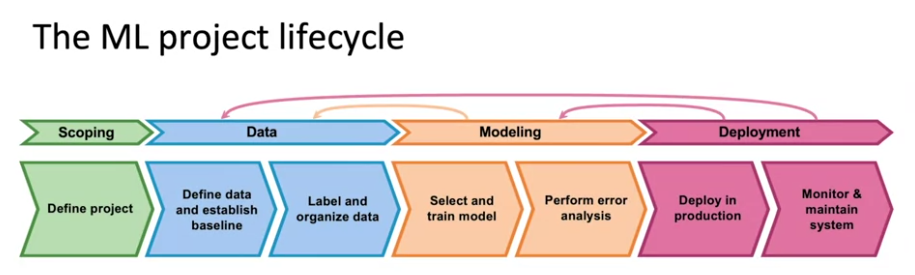

# I. [Overview](https://www.coursera.org/learn/introduction-to-machine-learning-in-production/lecture/PhRTU/steps-of-an-ml-project)

- Most people think that when the **Model is done**, the development is also done. (the **Modeling** part)
- But when doing **Modeling** or **Deployment**, data might be **shifted**, **new kind** of samples emerge, system **can't perform efficiently**, etc. => Have to go back to the **Data** or **Modeling** part

## Case study