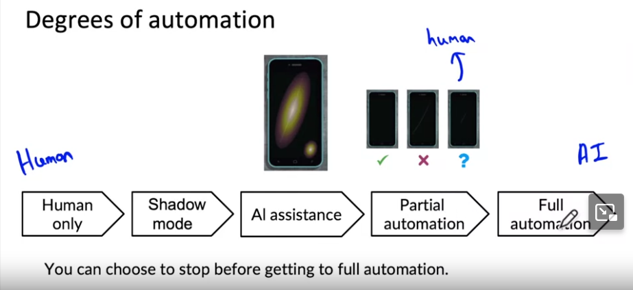
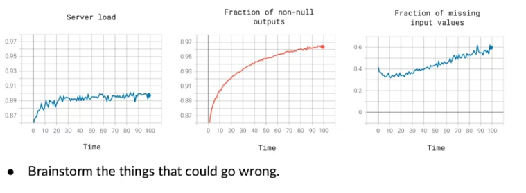

## [Key Challenges in Deployment][1]
### Concept/Data Drift.
    E.g.: Speech recognision: 
- Training set: Purchased data, historical user data with transcripts
- Test set: Data from a few months ago 
**=> How has data change ?**
- Concept vs Data:
    - Data is changed in **distribution**
    - Concept is the change in relationship **between dependent and independent variables**
    => When data is **drifted to the enough amount** => Concept changed 
    => **Gradual** change in **quantity** => changes in **Quality**

### Software issues.
- Realtime vs Batch.
- Cloud vs Edge/Browser.
- Compute resources
- Latency, throughput
- Logging
- Security and Privacy

## [Deployment Patterns][2]
### Common deployment cases:
- New product/capability
- Automate/assist with manual task
- Replace previous ML systems
### Key ideas:
#### Gradual change in deployment. E.g.: 
> Detecting *scratchs* on *mobile screens manufacturor*.  
- Deploy the ML in shadow mode: **Human and ML working together**.  
- The model will try to **detect scratches**. Also **learn to match human's predictions**.  
    => ML's predictions will not be used in making decisions.

#### Fallback plan. E.g.:
> **Blue Green** deployment
- Run your new ML system **alongside old services.**
- A **router** will **rotate** the **direction** to which data was sent, **between old vs new system.**
- Continuously **monitor both** old and new system.

### Degress of automation. How much ML is helpfull ?

- From: Human's labor only
- To: A system using only AI.
- The system is usefull from **Stage:  AI assitance** (E.g. in picture: highlighting the scratches).

## [Monitoring the ML systems][3]:

- What will go wrong
- How to measure those things  
- Set thresholds above and below. 
=> dashboards

## [Pipeline monitoring][4]:

[1]:https://www.coursera.org/learn/introduction-to-machine-learning-in-production/lecture/k9iID/key-challenges
[2]:https://www.coursera.org/learn/introduction-to-machine-learning-in-production/lecture/DugTF/deployment-patterns
[3]:https://www.coursera.org/learn/introduction-to-machine-learning-in-production/lecture/lRRnW/monitoring
[4]:https://www.coursera.org/learn/introduction-to-machine-learning-in-production/lecture/tQ8eI/pipeline-monitoring