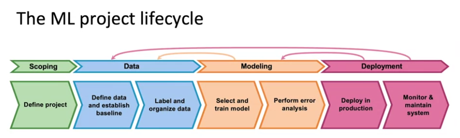
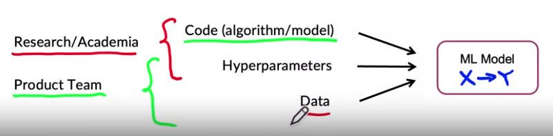

# [Overview](https://www.coursera.org/learn/introduction-to-machine-learning-in-production/lecture/PhRTU/steps-of-an-ml-project)

- Most people think that when the **Model is done**, the development is also done. (the **Modeling** part)
- But when doing **Modeling** or **Deployment**, data might be **shifted**, **new kind** of samples emerge, system **can't perform efficiently**, etc. => Have to go back to the **Data** or **Modeling** part

## [Case study: Speech Recognition](https://www.coursera.org/learn/introduction-to-machine-learning-in-production/lecture/bwXgc/case-study-speech-recognition)
- Define metrics, resources needed => timeline
- Data:
    - Consistent labeling
    - Silence before/after each clip ?
    - Volume normalization ?
    - etc.
- Modeling = Code + Hyperparameters + Data
    - **Researchers** tend to work on the **code and Hyperparameter**, **Data** is fixed
    - In **production**, they tend to work more on **Hyperparameter** and **Data**, the **Code** tends to be **developed once**, and some **small mainteinances** afterward
    
    - Error Analysis => what **kind/amount** of **Data** needs to be collected more ? **What/How** to change in **Hyperparameters**
- In **Deployment**, when the app is **more adopted by young audience**, => The Data is **drift**, more **young voices** to recognise