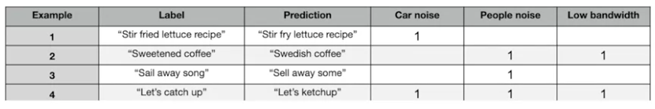

## [Error Analysis][1]
### Find the Noises/Similarities among Error Predictions
- Tested the model on the **small training dataset**
- List out the model's **ERRORS**, A.K.A. **wrong labeling**
- Try to find **simlarities** (*noises*) among those **wrongly labeled data**
- E.g.:
    - Using Spreadsheet, tag **each predictions** with **posible noises**. Each tag is represented by a column. When **checking the sample**, **new colum**(noise type/tag) might come up.

    - In **recommendation system**, when some recommendation is not **good/precise** => check **demographic** (is it for young women, childen, specific people with specific age/nationality/jobs, etc. )

### It's an iterative Process
=> **Improve the model** in those identified **noise environment**

### Usefull metrics for each found tag/noise => Decide what to work on.
- fraction of that tag in the error group.
- fraction of error in that tag group.
- fraction of data has that tag
- how much can be improved the model to be better at that tag 

[1]:https://www.coursera.org/learn/introduction-to-machine-learning-in-production/lecture/0wecB/error-analysis-example