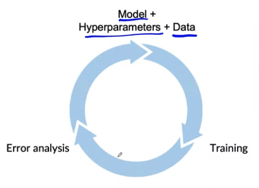
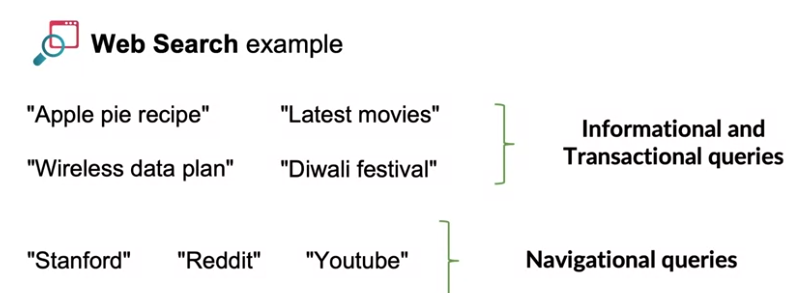
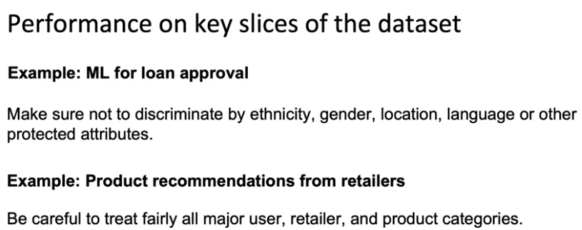
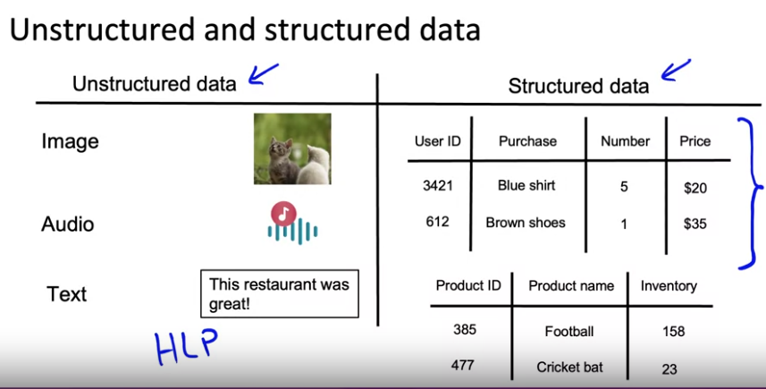

## [This week Overview][1]
- Learning about key challenges, in deployment.
- Focus in modeling part:
    - Select/train model
    - Error analysis
- 2 types of development strategies (can be used together/sequentially):
    - Model-centric development
    - Data-centric development

## [Challenges][2]:
- 1. Do well on training set (Avg training error)
- 2. Doing well on dev/test sets.
- 3. Do well on business metrics/project goals

## [Why low average error isn't good enough][3]
- Performance on disproportionately important samples.
> E.g: in **Web Search**, for *informational queries*, *appxoximation* is enough, but with **navigational queries**, user required exact results
> 
> => Model has to **perform significantly better** at some **specific types** of **queries/samples**
> => Avg error rate is not enough

- Bias

> => Needs to do **analysis** on **specific slices of dataset**

- Rare classes => Skewness

## [Establish a baseline - to identify the scope of the project][4]

### Unstructured data:
- Use **Human Level Performance** (HLP) to indicate **baseline**.
- To tell if your model is **on par with HLP.**
- If not, how much **percentage** ? => improve on the model components that **is most far from HLP**

### Structured data:
- 
### Common:
- HLP
- Search for other **open source/companies' model performance** on same problem.
- Performance of **older system**.
> ### => Always bargain with the project/bussinesss owner for baseline before starting the project.

[1]:https://www.coursera.org/learn/introduction-to-machine-learning-in-production/lecture/TrGYq/modeling-overview
[2]:https://www.coursera.org/learn/introduction-to-machine-learning-in-production/lecture/OFPbm/key-challenges
[3]:https://www.coursera.org/learn/introduction-to-machine-learning-in-production/lecture/0MLwJ/why-low-average-error-isn-t-good-enough
[4]:https://www.coursera.org/learn/introduction-to-machine-learning-in-production/lecture/KYu4T/establish-a-baseline